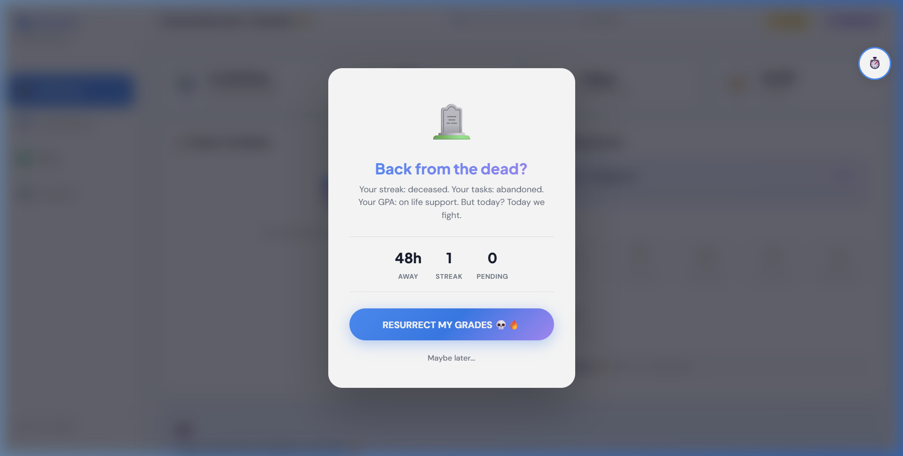

# Plan4U — Master Pitch Guide

> **One-liner:** Plan4U is an AI-powered, gamified study planner that turns exam prep into a game — with XP, streaks, badges, and Duolingo-style guilt-trip notifications that keep students coming back.

---

## 🎯 The Problem

Students face three core struggles when preparing for exams:

1. **No structure** — They have a syllabus but no actionable daily plan
2. **No motivation** — Studying feels like a chore with no reward feedback loop
3. **No accountability** — It's easy to skip a day and never come back

Existing tools either solve scheduling (Google Calendar) or motivation (Duolingo) — but **no tool does both for academic study**.

---

## 💡 The Solution — Plan4U

Plan4U is a **full-stack study planner** that combines:

| Pillar | How Plan4U Solves It |
|--------|---------------------|
| 🧠 **AI Scheduling** | Paste your syllabus → get a personalized daily study plan in seconds |
| 🎮 **Gamification** | XP, levels, streaks, badges, and confetti — learning feels like a game |
| ✅ **Task Verification** | Students must submit proof (URL/media) to earn full XP — real accountability |
| 😤 **Guilt-Trip Notifications** | Duolingo-style push notifications that escalate from gentle to nuclear |
| 📊 **Analytics** | Charts and stats showing study hours, task completion, and streak trends |
| ⏱️ **Pomodoro Timer** | Built-in focus/break timer with session tracking and XP rewards |

---

## 🏗️ Architecture Overview

```
┌──────────────────────────────────────────────────┐
│                   FRONTEND                        │
│  HTML5 + CSS3 + Vanilla JavaScript                │
│  ┌─────────┐ ┌─────────┐ ┌──────────┐ ┌────────┐│
│  │Dashboard│ │ Planner │ │  Tasks   │ │Analytics││
│  └────┬────┘ └────┬────┘ └────┬─────┘ └───┬────┘│
│       └───────────┼───────────┼────────────┘     │
│              js/api.js (API Client)               │
│         localStorage (write-through cache)        │
└───────────────────┬──────────────────────────────┘
                    │ REST API
┌───────────────────┴──────────────────────────────┐
│                   BACKEND                         │
│  Node.js + Express.js                             │
│  ┌────────────────────────────────────────────┐  │
│  │          18 REST API Endpoints             │  │
│  │   /api/tasks  /api/progress  /api/badges   │  │
│  │   /api/schedule  /api/sessions  /api/timer │  │
│  └───────────────────┬────────────────────────┘  │
│              SQLite (better-sqlite3)              │
│              8 tables · WAL mode                  │
│              db/plan4u.db (auto-created)          │
└──────────────────────────────────────────────────┘
```

---

## 🌟 Key Differentiators

### 1. AI Syllabus Parser
Upload a PDF or paste syllabus text → the parser extracts courses, exam dates, units, and topics automatically. No external API calls — it's a local heuristic engine that works offline.

### 2. Duolingo-Style Guilt-Trip System
Our notification engine has **4 escalating severity tiers** with 30+ unique messages:

| 🟢 Gentle (1hr) | *"It's okay if not, but I'd like it if you did."* |
|---|---|
| 🟡 Moderate (4hr) | *"Don't let this streak become a not-streak."* |
| 🔴 Aggressive (12hr) | *"Don't make me come over there."* |
| 💀 Nuclear (24hr+) | *"Your study plan wrote a goodbye letter. Don't let it end like this."* |

Even the **dismiss button** guilt-trips you: *"Your textbook just shed a tear. 📖💧"*

#### 5 Demo Notifications for Judges

> **1. 🟢 Gentle (1hr away)**
> 📚 *Hey there!* — Your books aren't going to read themselves... just saying.

> **2. 🟡 Moderate (4hr away)**
> 📚 *We noticed...* — Looks like you've forgotten about your study sessions. Again.

> **3. 🔴 Aggressive (12hr away)**
> 😤 *Plan4U is disappointed* — You've let Plan4U down. Who will be next? Your professor? Your GPA?

> **4. 💀 Nuclear (24hr+ away)**
> 🚨 *This is an intervention* — Your friends, your family, your GPA — we're all here because we care. Open Plan4U.

> **5. 🎭 Comeback Splash (returning after 2 days)**
> 😤 **Finally!** — *Do you know how long I've been sending you notifications? Your books almost filed a missing person report.*
> Stats shown: `48h Away · 0 Streak · 5 Pending`
> CTA: `I'm Back! Forgive Me 😅`
> Dismiss toast: *"That's 3 times you've dismissed me. I'm counting."*

**Live demo command** — Paste in browser console to trigger nuclear comeback splash:
```js
localStorage.setItem('plan4u_last_visit', (Date.now() - 48*60*60*1000).toString());
localStorage.removeItem('plan4u_comeback_shown_date');
location.reload();
```

**Screenshot — Nuclear Comeback Splash:**



### 3. Proof-Based Task Verification
Students can't just mark tasks "done" — they must:
- Submit a **URL** (to an assignment, quiz, or resource) → +100 XP
- Upload **media proof** (screenshot, PDF, photo) → +150 XP
- Or skip verification → only +25 XP (with a guilt message)

### 4. Works Online & Offline
The app gracefully degrades:
- **With backend** → data in SQLite database, synced across sessions
- **Without backend** → falls back to `localStorage`, fully functional

---

## 📊 Tech Stack

| Layer | Technology | Why |
|-------|-----------|-----|
| Frontend | HTML5, CSS3, Vanilla JS | Zero dependencies, instant load, no build step |
| Backend | Node.js + Express.js | Lightweight, fast, easy to deploy |
| Database | SQLite (better-sqlite3) | Free, zero-config, single-file, perfect for study apps |
| Charts | Chart.js (CDN) | Beautiful, responsive charts out of the box |
| PDF Parse | pdf.js (CDN) | Extract syllabus text from uploaded PDFs |

---

## 🎮 Gamification System

### XP Rewards

| Action | XP |
|--------|----|
| Daily login | +10 |
| Streak maintained | +15 |
| Schedule generated | +30 |
| Study block completed | +20 |
| Task verified (URL) | +100 |
| Task verified (media) | +150 |
| Pomodoro session | +25 |

### Levels

| Level | XP | Title |
|-------|----|-------|
| 1 | 0 | Beginner |
| 2 | 200 | Student |
| 3 | 500 | Learner |
| 4 | 1000 | Scholar |
| 5 | 2000 | Expert |
| 6 | 4000 | Master |
| 7 | 8000 | Legend |

### 6 Earnable Badges
🔥 On Fire (3-day streak) · 📅 Consistent (7-day streak) · ✅ Task Master (10 tasks) · ⏰ Dedicated (5 study hours) · 🏆 Week Warrior (7 consecutive days) · 🎯 Planner Pro (3 schedules)

---

## 🚀 How to Run

```bash
# Clone the repository
git clone https://github.com/sahil007-ai/raisoni.git
cd raisoni

# Install dependencies
npm install

# Start the server
npm start

# Open in browser
# http://localhost:3000
```

**No backend? No problem.** Just open `index.html` directly — the app works with `localStorage` alone.

---

## 📄 Pages

| Page | Purpose |
|------|---------|
| `index.html` | Landing page with hero, features, and CTA |
| `dashboard.html` | Daily stats, schedule snapshot, badges, motivation |
| `planner.html` | 3-step wizard: Upload → Review → Generate schedule |
| `tasks.html` | Task CRUD with verification modal |
| `analytics.html` | Charts, Pomodoro timer, session history |

---

## 🛣️ Future Roadmap

- [ ] **User authentication** — Login/signup for multi-user support
- [ ] **Cloud deployment** — Deploy backend to Render/Railway for cross-device sync
- [ ] **Service Worker** — True offline push notifications even when browser is closed
- [ ] **AI-powered study recommendations** — Suggest optimal study times based on performance
- [ ] **Social features** — Study groups, shared schedules, leaderboards
- [ ] **Mobile app** — PWA or React Native wrapper for mobile

---

## 👥 Team

| Member | Role |
|--------|------|
| Sahil | Developer |

---

## 📬 Links

- **GitHub**: [github.com/sahil007-ai/raisoni](https://github.com/sahil007-ai/raisoni)
- **Live Demo**: Run locally with `npm start` on port 3000

---

> *"Plan4U doesn't just help you study — it makes you feel guilty enough to actually do it."* 😤📚
